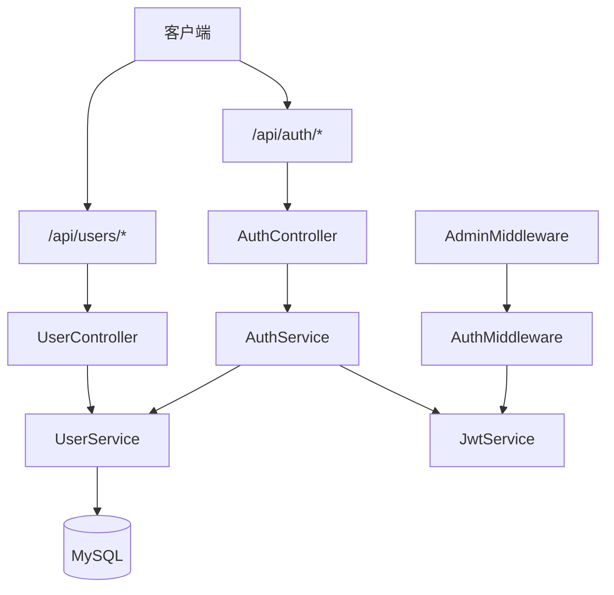
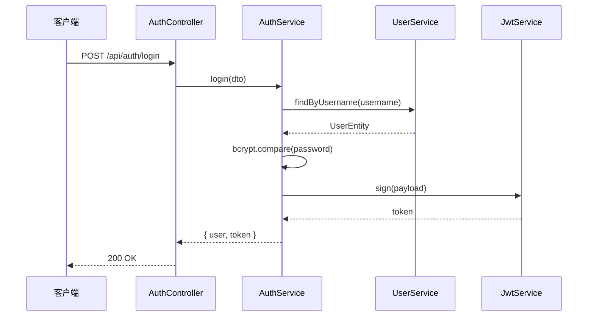

# 用户登录管理系统设计方案

## 1. 背景与目标

基于 Midway 4 + Koa 实现一套完整的用户登录与管理系统，覆盖用户注册、登录、资料维护、密码修改，以及管理员对用户进行查询、启用/禁用和删除等操作。

**核心目标：**

- 提供标准化的 REST API
- 使用 JWT 实现无状态认证
- 密码安全存储，接口参数校验完备
- 区分普通用户与管理员角色

---

## 2. 整体架构



### 2.1 分层职责

| 层级 | 目录 | 职责 |
|------|------|------|
| Controller | `src/controller/` | 路由定义、请求入参、响应封装 |
| Service | `src/service/` | 业务逻辑（认证、用户 CRUD） |
| Entity | `src/entity/` | TypeORM 数据模型 |
| DTO | `src/dto/` | 请求参数校验规则 |
| Middleware | `src/middleware/` | JWT 鉴权、管理员权限校验 |
| Filter | `src/filter/` | 统一异常响应格式 |
| Config | `src/config/` | JWT、数据库等配置 |

### 2.2 技术选型

| 模块 | 方案 | 说明 |
|------|------|------|
| Web 框架 | Midway 4 + Koa | 项目基础框架 |
| 认证 | `@midwayjs/jwt` | Bearer Token，默认 7 天过期 |
| 密码加密 | `bcryptjs` | 哈希存储，不保存明文 |
| 数据库 | `@midwayjs/typeorm` + MySQL | 通过环境变量配置连接，默认库名 `awesome_admin` |
| 参数校验 | `@midwayjs/validate` | DTO + Joi 规则 |
| 权限模型 | RBAC（简化版） | `user` / `admin` 两种角色 |

> **注意：** Midway v4 移除了隐式文件扫描，需在 `configuration.ts` 中显式配置 `CommonJSFileDetector`。

---

## 3. 数据模型

### 3.1 用户表 `users`

| 字段 | 类型 | 说明 |
|------|------|------|
| `id` | int | 主键，自增 |
| `username` | varchar(50) | 用户名，唯一 |
| `password` | varchar | 密码哈希，查询时默认不返回 |
| `email` | varchar(100) | 邮箱，可空 |
| `phone` | varchar(20) | 手机号，可空 |
| `role` | varchar(20) | 角色：`user` / `admin` |
| `status` | int | 状态：`1` 启用 / `0` 禁用 |
| `createdAt` | datetime | 创建时间 |
| `updatedAt` | datetime | 更新时间 |

### 3.2 枚举定义

```typescript
// src/constant/user.constant.ts
enum UserRole {
  USER = 'user',
  ADMIN = 'admin',
}

enum UserStatus {
  DISABLED = 0,
  ACTIVE = 1,
}
```

### 3.3 JWT Payload

```typescript
interface IJwtPayload {
  userId: number;
  username: string;
  role: UserRole;
}
```

---

## 4. API 设计

### 4.1 公开接口（无需 Token）

#### 注册

```
POST /api/auth/register
```

请求体：

```json
{
  "username": "testuser",
  "password": "test1234",
  "email": "test@example.com",
  "phone": "13800138000"
}
```

响应：

```json
{
  "success": true,
  "message": "注册成功",
  "data": {
    "user": { "id": 2, "username": "testuser", "role": "user", ... },
    "token": "eyJhbGciOiJIUzI1NiIs..."
  }
}
```

#### 登录

```
POST /api/auth/login
```

请求体：

```json
{
  "username": "admin",
  "password": "admin123"
}
```

### 4.2 用户接口（需登录）

请求头：`Authorization: Bearer <token>`

| 方法 | 路径 | 说明 |
|------|------|------|
| GET | `/api/auth/profile` | 获取当前用户信息 |
| PUT | `/api/auth/profile` | 更新邮箱、手机号 |
| PUT | `/api/auth/password` | 修改密码（需原密码） |

### 4.3 管理员接口（需 admin 角色）

| 方法 | 路径 | 说明 |
|------|------|------|
| GET | `/api/users` | 用户列表（分页、关键词搜索） |
| GET | `/api/users/:id` | 用户详情 |
| PUT | `/api/users/:id/status` | 启用/禁用用户 |
| DELETE | `/api/users/:id` | 删除用户 |

列表查询参数：

| 参数 | 类型 | 默认值 | 说明 |
|------|------|--------|------|
| `page` | number | 1 | 页码 |
| `pageSize` | number | 10 | 每页条数（最大 100） |
| `keyword` | string | - | 搜索用户名/邮箱/手机号 |

### 4.4 统一响应格式

成功：

```json
{
  "success": true,
  "message": "OK",
  "data": { ... }
}
```

失败（`AuthError`）：

```json
{
  "success": false,
  "message": "用户名或密码错误",
  "data": null
}
```

---

## 5. 认证与鉴权流程

### 5.1 登录流程



### 5.2 鉴权中间件

**AuthMiddleware**（`authMiddleware`）

1. 从 `Authorization` 头提取 Bearer Token
2. 调用 `JwtService.verify()` 校验
3. 将解析后的 `IJwtPayload` 写入 `ctx.state.user`
4. 校验失败抛出 `AuthError`（401）

**AdminMiddleware**（`adminMiddleware`）

1. 检查 `ctx.state.user.role === 'admin'`
2. 非管理员抛出 `AuthError`（403）

中间件通过路由装饰器按名称挂载：

```typescript
@Get('/profile', { middleware: ['authMiddleware'] })
@Controller('/api/users', { middleware: ['authMiddleware', 'adminMiddleware'] })
```

---

## 6. 安全设计

| 措施 | 实现方式 |
|------|----------|
| 密码存储 | `bcryptjs` 哈希，salt rounds = 10 |
| 密码不可见 | Entity 字段 `select: false`，查询时需 `addSelect` |
| Token 传输 | HTTP Header `Authorization: Bearer <token>` |
| 禁用账号 | `status = 0` 时拒绝登录 |
| 自删保护 | 管理员不能删除当前登录账号 |
| 生产密钥 | `jwt.secret` 需替换为强随机字符串 |

### 6.1 默认管理员

应用首次启动时，若用户表为空，自动创建：

| 字段 | 值 |
|------|-----|
| username | `admin` |
| password | `admin123` |
| role | `admin` |
| email | `admin@example.com` |

> 生产环境部署后请立即修改默认密码。

---

## 7. 目录结构

```
src/
├── configuration.ts          # 组件注册、Filter 自动发现
├── config/
│   ├── config.default.ts     # JWT、TypeORM 配置
│   └── config.unittest.ts    # 测试环境（内存数据库）
├── constant/
│   └── user.constant.ts      # 角色、状态枚举
├── controller/
│   ├── auth.controller.ts    # 认证相关路由
│   └── user.controller.ts    # 用户管理路由（管理员）
├── dto/
│   └── auth.dto.ts           # 请求参数 DTO
├── entity/
│   └── user.entity.ts        # 用户实体
├── error/
│   └── auth.error.ts         # 认证业务异常
├── filter/
│   └── auth.filter.ts        # 异常响应格式化
├── middleware/
│   ├── auth.middleware.ts    # JWT 鉴权
│   └── admin.middleware.ts   # 管理员权限
├── service/
│   ├── auth.service.ts       # 登录、注册、签发 Token
│   └── user.service.ts       # 用户 CRUD
└── interface.ts              # 类型定义、Context 扩展
```

---

## 8. 配置说明

### 8.1 JWT（`config.default.ts`）

```typescript
jwt: {
  secret: 'midway-user-auth-secret-change-in-production',
  sign: {
    expiresIn: '7d',
  },
},
```

### 8.2 数据库

通过环境变量配置 MySQL 连接（可参考项目根目录 `.env.example`）：

| 变量 | 默认值 | 说明 |
|------|--------|------|
| `MYSQL_HOST` | `127.0.0.1` | 数据库主机 |
| `MYSQL_PORT` | `3306` | 端口 |
| `MYSQL_USERNAME` | `root` | 用户名 |
| `MYSQL_PASSWORD` | 空 | 密码 |
| `MYSQL_DATABASE` | `awesome_admin` | 库名 |

```typescript
typeorm: {
  dataSource: {
    default: {
      type: 'mysql',
      host: process.env.MYSQL_HOST || '127.0.0.1',
      port: Number(process.env.MYSQL_PORT || 3306),
      username: process.env.MYSQL_USERNAME || 'root',
      password: process.env.MYSQL_PASSWORD || '',
      database: process.env.MYSQL_DATABASE || 'awesome_admin',
      charset: 'utf8mb4',
      synchronize: true,  // 生产环境应设为 false，使用 migration
      entities: [UserEntity],
    },
  },
},
```

启动前需先创建数据库：

```sql
CREATE DATABASE awesome_admin CHARACTER SET utf8mb4 COLLATE utf8mb4_unicode_ci;
```

测试环境（`config.unittest.ts`）仍使用 SQLite 内存数据库（`:memory:`），测试间互不影响。

---

## 9. 本地开发与测试

### 9.1 环境要求

- Node.js >= 20
- npm
- MySQL >= 5.7 或 8.x

### 9.2 启动

```bash
# 复制环境变量并按需修改
cp .env.example .env

# 创建数据库（在 MySQL 中执行）
# CREATE DATABASE awesome_admin CHARACTER SET utf8mb4 COLLATE utf8mb4_unicode_ci;

npm install
npm run dev
```

服务地址：`http://127.0.0.1:7001`

### 9.3 快速验证

```bash
# 登录
curl -X POST http://127.0.0.1:7001/api/auth/login \
  -H 'Content-Type: application/json' \
  -d '{"username":"admin","password":"admin123"}'

# 获取个人信息（替换 <token>）
curl http://127.0.0.1:7001/api/auth/profile \
  -H 'Authorization: Bearer <token>'

# 注册用户
curl -X POST http://127.0.0.1:7001/api/auth/register \
  -H 'Content-Type: application/json' \
  -d '{"username":"testuser","password":"test1234","email":"test@example.com"}'
```

### 9.4 运行测试

```bash
npm test
```

---

## 10. 后续扩展建议

| 方向 | 说明 |
|------|------|
| 数据库迁移 | 生产环境关闭 `synchronize`，使用 TypeORM Migration |
| 刷新 Token | 增加 refresh token 机制，缩短 access token 有效期 |
| 登录限流 | 对 `/api/auth/login` 增加频率限制，防暴力破解 |
| 操作审计 | 记录管理员对用户的状态变更、删除操作 |
| 前端管理页 | 可基于现有 API 开发 React/Vue 管理后台 |
